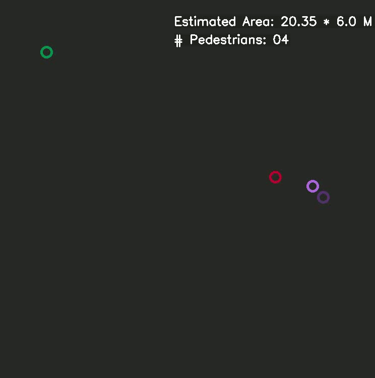

# cds-tracking

## Описание:

Этот репозиторий является реализацией метода FairMOT: базовая линия для одноэтапного отслеживания нескольких объектов в дополнение к Bird-eye визуализации выходных треков в 2D-плоскости.


> [**A Simple Baseline for Multi-Object Tracking**](http://arxiv.org/abs/2004.01888),            
> Yifu Zhang, Chunyu Wang, Xinggang Wang, Wenjun Zeng, Wenyu Liu,        
> *arXiv technical report ([arXiv 2004.01888](http://arxiv.org/abs/2004.01888))*

## Video demos on MOT challenge test set
   
   


## Установка
* Клонируйте этот репозиторий в свой ${FAIRMOT_ROOT}
* Установите зависимости. При разработке использовался Python 3.7 и pytorch >= 1.2.0.
```
conda create -n FairMOT
conda activate FairMOT
conda install pytorch==1.2.0 torchvision==0.4.0 cudatoolkit=10.0 -c pytorch
cd ${FAIRMOT_ROOT}
pip install -r requirements.txt
cd src/lib/models/networks/DCNv2_new sh make.sh
```
* [DCNv2](https://github.com/CharlesShang/DCNv2) используется в основной сети и более подробную информацию можно найти в их отчете. 
* Чтобы запустить код для демо-версий, вам также необходимо установить [ffmpeg](https://www.ffmpeg.org/).

## Подготовка данных

Мы используем те же данные обучения, как и [JDE](https://github.com/Zhongdao/Towards-Realtime-MOT). Пожалуйста, обратитесь к их [DATA ZOO](https://github.com/Zhongdao/Towards-Realtime-MOT/blob/master/DATASET_ZOO.md) чтобы загрузить и подготовить все данные обучения, включая Caltech Pedestrian, CityPersons, CUHK-SYSU, PRW, ETHZ, MOT17 и MOT16.

[2DMOT15](https://motchallenge.net/data/2D_MOT_2015/) и [MOT20](https://motchallenge.net/data/MOT20/) можно скачать с официальной веб-страницы MOT challenge. После загрузки вы должны подготовить данные в следующей структуре:
```
MOT15
   |——————images
   |        └——————train
   |        └——————test
   └——————labels_with_ids
            └——————train(empty)
MOT20
   |——————images
   |        └——————train
   |        └——————test
   └——————labels_with_ids
            └——————train(empty)
```
Затем вы можете изменить seq_root и label_root в src/gen_labels_15.py и еще src/gen_labels_20.py и запустите:
```
cd src
python gen_labels_15.py
python gen_labels_20.py
```
для генерации меток 2DMOT15 и MOT20. Seqinfo.ini файлы 2DMOT15 можно скачать здесь [[Google]](https://drive.google.com/open?id=1kJYySZy7wyETH4fKMzgJrYUrTfxKlN1w).

## Pretrained models and baseline model
* **Pretrained models**

DLA-34 COCO pretrained model: [DLA-34 official](https://drive.google.com/file/d/1pl_-ael8wERdUREEnaIfqOV_VF2bEVRT/view).
HRNetV2 ImageNet pretrained model: [HRNetV2-W18 official](https://1drv.ms/u/s!Aus8VCZ_C_33cMkPimlmClRvmpw), [HRNetV2-W32 official](https://1drv.ms/u/s!Aus8VCZ_C_33dYBMemi9xOUFR0w).
После загрузки вы должны поместить Pretrained model в следующую структуру:
```
${FAIRMOT_ROOT}
   └——————models
           └——————ctdet_coco_dla_2x.pth
           └——————hrnetv2_w32_imagenet_pretrained.pth
           └——————hrnetv2_w18_imagenet_pretrained.pth
```
* **Baseline model**

Базовую модель FairMOT можно скачать здесь: DLA-34: [[Google]](https://drive.google.com/open?id=1udpOPum8fJdoEQm6n0jsIgMMViOMFinu). HRNetV2_W18: [[Google]](https://drive.google.com/open?id=182EHCOSzVVopvAqAXN5o6XHX4PEyLjZT).
После загрузки вы должны поместить базовую модель в следующую структуру:
```
${FAIRMOT_ROOT}
   └——————models
           └——————all_dla34.pth
           └——————all_hrnet_v2_w18.pth
           └——————...
```

## Обучение
* Загрузите тренировочные данные.
* Измените дерикторий набора данных 'root' в src/lib/cfg/data.json и 'data_dir' в src/lib/opts.py
* Запустите:
```
sh experiments/all_dla34.sh
```

## Отслеживание
* Настройки по умолчанию запускают отслеживание для набора данных проверки из 2DMOT15. Используя базовую модель DLA-34, вы можете запустить:
```
cd src
python track.py mot --load_model ../models/all_dla34.pth --conf_thres 0.6
```
чтобы увидеть результаты отслеживания (76.1 MOTA с использованием базовой модели DLA-34). Вы также можете выбрать save_images=True в src/track.py для сохранения результатов визуализации каждого кадра. 

Используя базовую модель HRNetV2-W18, вы можете запустить:
```
cd src
python track.py mot --load_model ../models/all_hrnet_v2_w18.pth --conf_thres 0.6 --arch hrnet_18 --reid_dim 128
```
чтобы увидеть результаты отслеживания (76.6 MOTA с использованием базовой модели HRNetV2-W18).

* Чтобы получить txt-результаты тестового набора MOT16 или не MOT17, вы можете запустить:
```
cd src
python track.py mot --test_mot17 True --load_model ../models/all_dla34.pth --conf_thres 0.4
python track.py mot --test_mot16 True --load_model ../models/all_dla34.pth --conf_thres 0.4
```
и отправьте txt-файлы в [MOT challenge](https://motchallenge.net) оценочный сервер для получения результатов. ((Вы можете получить общие результаты 67.5 MOTA на тестовом наборе MOT17, используя базовую модель 'all_dla34.pth'.)

* Чтобы получить общие результаты 2DMOT15, и MOT20, вам нужно точно настроить базовую модель на конкретном наборе данных, потому что наш обучающий набор их не содержит. Вы можете запустить:
```
sh experiments/ft_mot15_dla34.sh
sh experiments/ft_mot20_dla34.sh
```
а затем запустите код отслеживания:
```
cd src
python track.py mot --test_mot15 True --load_model your_mot15_model.pth --conf_thres 0.3
python track.py mot --test_mot20 True --load_model your_mot20_model.pth --conf_thres 0.3 --K 500
```
Results of the test set all need to be evaluated on the MOT challenge server. You can see the tracking results on the training set by setting --val_motxx True and run the tracking code. We set 'conf_thres' 0.4 for MOT16 and MOT17. We set 'conf_thres' 0.3 for 2DMOT15 and MOT20. You can also use the SOTA MOT20 pretrained model here [[Google]](https://drive.google.com/open?id=1GInbQoCtp1KHVrhzEof77Wt07fvwHcXb):
```
python track.py mot --test_mot20 True --load_model ../models/mot20_dla34.pth --reid_dim 128 --conf_thres 0.3 --K 500
```
After evaluating on MOT challenge server, you can get 58.7 MOTA on MOT20 test set using the model 'mot20_dla34.pth'.

## Bird Eye View for tracks:
После запуска track_birdeye_vis.py, откроется окно первого кадра в видео. В этот момент код ожидает, что пользователь отметит 6 точек, щелкнув соответствующие позиции на кадре.

### Первые 4 точки:
Первые 4 из 6 необходимых точек используются для обозначения области интереса (ROI), где вы хотите осуществлять мониторинг. Более того, линии, отмеченные этими точками, должны быть параллельными линиями в реальном мире, как видно сверху. Например, эти линии могут быть бордюрами дороги.
Эти 4 пункта должны быть представлены в заранее определенном порядке, который является следующим.

* __Point1 (bl)__: внизу слева
* __Point2 (br)__: внизу справа
* __Point3 (tl)__: вверху слева
* __Point4 (tr)__: вверху справа

### Последние 2 балла:
Последние две точки используются для обозначения двух точек на расстоянии 6 футов друг от друга в интересующей области. Например, это может быть рост человека (легче отметить на кадре)

 

## Demo
You can input a raw video and get the demo video by running src/demo.py and get the mp4 format of the demo video:
```
cd src
python demo.py mot --load_model ../models/all_dla34.pth --conf_thres 0.4
```
You can change --input-video and --output-root to get the demos of your own videos.

If you have difficulty building DCNv2 and thus cannot use the DLA-34 baseline model, you can run the demo with the HRNetV2_w18 baseline model (don't forget to comment lines with 'dcn' in src/libs/models/model.py if you do not build DCNv2): 
```
cd src
python demo.py mot --load_model ../models/all_hrnet_v2_w18.pth --arch hrnet_18 --reid_dim 128 --conf_thres 0.4
```
--conf_thres can be set from 0.3 to 0.7 depending on your own videos.

## Tracking performance
### Results on MOT challenge test set
| Dataset    |  MOTA | IDF1 | IDS | MT | ML | FPS |
|--------------|-----------|--------|-------|----------|----------|--------|
|2DMOT15  | 59.0 | 62.2 |  582 | 45.6% | 11.5% | 30.5 |
|MOT16       | 68.7 | 70.4 | 953 | 39.5% | 19.0% | 25.9 |
|MOT17       | 67.5 | 69.8 | 2868 | 37.7% | 20.8% | 25.9 |
|MOT20       | 58.7 | 63.7 | 6013 | 66.3% | 8.5% | 13.2 |

 All of the results are obtained on the [MOT challenge](https://motchallenge.net) evaluation server under the “private detector” protocol. We rank first among all the trackers on 2DMOT15, MOT17 and the recently released (2020.02.29) MOT20. Note that our IDF1 score remarkably outperforms other one-shot MOT trackers by more than **10 points**. The tracking speed of the entire system can reach up to **30 FPS**.
